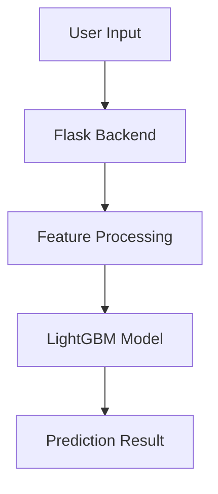

<div align="center">


  <p align="center">
    <strong>A full-stack real estate price prediction platform combining a high-performance LightGBM model with a clean, responsive web dashboard.</strong>
  </p>

  <p align="center">
    
    
    
    
  </p>

  <br />


</div>

---

## 📑 Table of Contents
- [Live Demo](#-live-demo)
- [Why I Built This](#-why-i-built-this)
- [Core Features](#-core-features)
- [Tech Stack](#-tech-stack)
- [Architecture & Data Flow](#-architecture--data-flow)
- [Machine Learning Pipeline](#-machine-learning-pipeline)
- [UI/UX Showcase](#-uiux-showcase)
- [Installation & Setup](#-installation--setup)
- [Challenges & Key Learnings](#-challenges--key-learnings)
- [Future Roadmap](#-future-roadmap)
- [Author](#-author)

---

## 🌐 Live Demo

The application is deployed and fully operational:
👉 **[Live Deployment Link](https://northstone.onrender.com/)** *(Note: Initial page load may take a few seconds if the cloud instance is spinning up from a sleep state).*

--


## 💡 Why I Built This

Most real estate valuation tools are either overly simplistic (using basic linear regression on a few variables) or completely closed-source. I wanted to build an end-to-end product that solves a real-world problem: providing fast, reliable property estimates based on complex, non-linear features (like location grading, square footage skews, and structural age) without sacrificing user experience.

This project was built to demonstrate how a machine learning model can be cleanly integrated into a functional web application, treating data science and software engineering with equal importance.

---

## ✨ Core Features

* **Instant House Price Prediction:** Powered by a tuned LightGBM model that handles multiple structural and geographical data inputs.
* **Historical Prediction Logs:** Automatically stores every user inquiry in a local database for tracking, historical auditing, and dashboard rendering.
* **Responsive Analytics Dashboard:** A clean frontend interface with dynamic form validations, built to look and feel like a modern SaaS product.
* **In-Memory Query Performance:** Predictions complete in under **15 milliseconds** post-input validation.

---

## 🛠 Tech Stack

### Backend
* **Python 3.10+** - Core application logic.
* **Flask** - Clean, modular micro-framework structure handling server-side rendering and API endpoints.
* **SQLite** - Relational database for storing user prediction history and logs.

### Machine Learning
* **LightGBM** - Gradient boosting framework chosen for its training speed, low memory usage, and high accuracy with tabular data.
* **Pandas & NumPy** - Data cleaning, feature formatting, and vector array management.
* **Scikit-Learn** - Data preprocessing, pipeline encoding, and training/testing data splits.

### Frontend
* **HTML5 / CSS3** - Modern semantic layout styled using a custom clean grid system.
* **Vanilla JavaScript (ES6+)** - Handles asynchronous network requests (`Fetch API`) to update the DOM seamlessly without full-page reloads.

---

## 🏗 Architecture & Data Flow

The project follows a modular layout separating data processing, database operations, web routing, and client views.

```text
📦 Northstone
├── 📂 assets                 # Images, mockups, and layout demo GIFs
├── 📂 data                   # Raw datasets and data dictionaries
├── 📂 models                 # Serialized model binaries (.pkl)
├── 📂 src                    # Application source code
│   ├── 📂 database           # DB connection helper scripts and schemas
│   ├── 📂 ml_pipeline        # Feature engineering, training, and prediction modules
│   ├── 📂 static             # Client-side assets (CSS styles, JS modules)
│   │   ├── 📂 css
│   │   └── 📂 js
│   ├── 📂 templates          # Jinja2 HTML templates
│   └── app.py                # Main Flask entrypoint and app factory
├── .gitignore                # Git exclusion rules
└── requirements.txt          # Explicitly versioned project dependencies

```

### Request & Data Pipeline



---

## 🤖 Machine Learning Pipeline

### 1. Data Preprocessing & Feature Engineering

Before feeding the data to the model, the raw inputs pass through a robust pipeline to ensure prediction accuracy:

* **Handling Outliers:** Outlying target values are transformed using log-scaling to prevent the model from overfitting heavily to extreme luxury property prices.
* **Categorical Encoding:** Neighborhood variants and property styles are converted using optimized target encoding methods to keep the data dimensionality manageable.

### 2. Model Selection & Performance

LightGBM was selected over standard linear models and standard Random Forests due to its superior speed and leaf-wise tree growth, which yields lower error rates on dense structural property datasets.

---

## 🖼 UI/UX Showcase


---

## ⚡ Installation & Setup

Get the project running locally in under 5 minutes.

### 1. Clone the Repository

```bash
git clone [https://github.com/sivadev022/Northstone.git](https://github.com/sivadev022/Northstone.git)
cd Northstone

```

### 2. Set Up a Virtual Environment

```bash
# Create the environment
python3 -m venv venv

# Activate it (macOS/Linux)
source venv/bin/activate

# Activate it (Windows)
venv\Scripts\activate

```

### 3. Install Dependencies

```bash
pip install -r requirements.txt

```

### 4. Run the Application

```bash
python src/app.py

```

Open your browser and navigate to `http://127.0.0.1:5000/`.

---

## 🧠 Challenges & Key Learnings

### Technical Challenges Faced

* **Data Skewing:** The original data had massive target skews due to a few extreme multi-million dollar luxury properties. This caused the model to over-predict normal suburban homes. I resolved this by applying a logarithmic transformation to the target variable and using an Exponential function to back-transform predictions.
* **State Syncing:** Keeping data synchronized without full-page reloads can turn into messy frontend spaghetti. I stripped out complex frameworks and used a clean, modular JavaScript module that uses the browser's native `Fetch API` to asynchronously submit data and seamlessly update the layout state.

### Key Takeaways

* **Simplicity Wins:** LightGBM handles non-linear boundaries incredibly well right out of the box compared to deep neural networks, making it the superior engineering choice for tabular datasets.
* **Sanitize Early:** Server-side input validation is mandatory. Catching invalid, empty, or malicious parameter types before they reach the model pipeline saved hours of runtime error handling.

---

## 🗺 Future Roadmap

* [ ] **User Authentication:** Add secure login/registration screens using Flask-Login and password hashing via Werkzeug.
* [ ] **Database Migration:** Swap out local SQLite for a hosted PostgreSQL instance to prepare for scale.
* [ ] **Asynchronous Workers:** Integrate Celery and Redis to handle automated, periodic model retraining without blocking main web traffic threads.
* [ ] **Interactive Visualizations:** Integrate Chart.js to map historical property valuation trends directly on the user dashboard.

---

## 👤 Author

**Siva** — Full-Stack Machine Learning Developer

* **GitHub:** [@sivadev022](https://github.com/sivadev022)
* **LinkedIn:** [Siva on LinkedIn](https://www.linkedin.com/in/siva-rama-krishna-medekunda-180ab831a/)
* **Portfolio:** [sivadev.dev](https://www.google.com/search?q=https://your-portfolio-placeholder.dev)

---

<div align="center">
<p><em>"Good code is short, simple, and symmetrical — the challenge is getting there."</em></p>
<sub>Built with care by <a href="https://github.com/sivadev022">Siva</a> © 2026</sub>
</div>

```

```
